# Roadmap Partie 2 — La salle de lecture

Plan d'implémentation basé sur `partie2-2_attention_transformers_et_reutilisation_de_modeles.pdf`.

## Vue d'ensemble

```mermaid
flowchart LR
    subgraph acte1 [Acte 1]
        P0[Phase 0 EDA 4 juillet]
        P1[Phase 1 RAPPORT critique]
    end
    subgraph acte2 [Acte 2 PyTorch]
        P2[Phase 2 Overfit 8]
        P3[Phase 3 vs lineaire]
        P4[Phase 4 Pannes]
        P5[Phase 5 Budget]
        P6[Phase 6 Receptive field]
        P7[Phase 7 Batch=4]
        P8[Phase 8 Masque shape]
        P9[Phase 9 Explain]
    end
    subgraph acte3 [Acte 3 Attention]
        P10[Phase 10 Single-head]
        P11[Phase 11 Pos encoding]
        P12[Phase 12 O n2]
        P13[Phase 13 Multi-head]
    end
    subgraph acte4 [Acte 4 Transfer]
        P14[Phase 14 HF model]
        P15[Phase 15 RAG Q&A]
        P16[Phase 16 Deploy]
        P17[Phase 17 Generation]
    end
    acte1 --> acte2 --> acte3 --> acte4
```



## Prérequis techniques

```bash
pip install -r requirements-part2.txt
python scripts/download_data.py
```

Dépendances ajoutées : `torch`, `transformers`, `accelerate`, `peft` (LoRA), `sentencepiece`.

**Colab** : notebook `notebooks/partie2_colab.ipynb` (à créer) pour phases GPU-intensives.

---

## Sprint 1 — Acte 1 (1-2 jours)

### Phase 0 — `src/shape/eda.py`

- [x] Charger `releves_klaxo3.csv` sans en-tête
- [x] Choisir et justifier date : `datetime` (observation) vs `date_posted` (publication)
- [x] Calculer : jours couverts, moy/jour, count 4 juillet, rang 4 juillet, max jour, top 10 jours
- [x] Courbe volume annuel → `reports/figures/volume_annuel.png`
- [x] Remplir section Phase 0 dans `RAPPORT.md`

### Phase 1 — RAPPORT écrit

- [ ] 3 parties sans code (voir PDF)
- [ ] Formuler tâche : `comments` → `shape`

---

## Sprint 2 — Acte 2 (3-5 jours)

### Module `src/shape/dataset.py`

Décisions à documenter dans RAPPORT :
- 2 922 relevés sans `shape` → exclure ou classe `unknown` ?
- Fusion `round`/`circle`, `changed`/`changing`
- Traitement `unknown`, `other`

### Phase 2 — `src/shape/overfit_test.py`

- [ ] 8 relevés, entraînement jusqu'à 100 % train
- [ ] Courbe loss, itérations, liste des changements si échec

### Phase 3 — `src/shape/train.py`

- [ ] Baseline : `TfidfVectorizer` + `LogisticRegression` (sklearn)
- [ ] Modèle PyTorch : Embedding + pooling + Linear ( puis RNN/CNN )
- [ ] Même split, mêmes classes
- [ ] Courbes train + val sur même figure
- [ ] Dummy « classe majoritaire »

Architecture minimale suggérée :

```python
# Embedding(vocab, 128) → mean pool → Linear(n_classes)
```

### Phases 4-5 — `src/shape/debug.py`, `src/shape/benchmark.py`

- [ ] 3 pannes : overfitting, learning rate, loss figée
- [ ] Chronomètre : DataLoader workers, batch size, AMP (Colab)

### Phases 6-7 — `src/shape/receptive_field.py`

- [ ] CNN ou stacked layers : tableau couche par couche
- [ ] Test perturbation mot début → sortie change
- [ ] BatchNorm → corriger pour batch=4 et inférence single-sample

### Phases 8-9 — `src/shape/mask_vocab.py`, `src/shape/explain.py`

- [ ] Liste mots interdits (shape + variantes + pluriels)
- [ ] Compte = 0 après filtrage
- [ ] Scores macro vs weighted avant/après
- [ ] Attribution mots (gradient × input ou attention weights)

---

## Sprint 3 — Acte 3 (2-3 jours)

### Module `src/attention/`

| Fichier | Phase | Contenu |
|---------|-------|---------|
| `single_head.py` | 10 | Q, K, V manuels ; softmax ; matrice affichée |
| `positional.py` | 11 | Pos encoding sinusoïdal ; test permutation |
| `benchmark.py` | 12 | Temps vs longueur 32-512 |
| `multi_head.py` | 13 | 2 têtes ; mesure désaccord |

**Interdit** : `nn.MultiheadAttention`, `transformers` pour phases 10-13.

Formule à implémenter :

```python
scores = Q @ K.T / (d ** 0.5)
weights = torch.softmax(scores, dim=-1)
output = weights @ V
```

---

## Sprint 4 — Acte 4 (3-5 jours)

### Phase 14 — `src/transfer/finetune.py`

Modèles candidats (petits, CPU/Colab) :
- `distilbert-base-uncased`
- `microsoft/deberta-v3-xsmall`
- `google/mobilebert-uncased`

3 régimes :
1. **Frozen** : features + tête linéaire
2. **Fine-tune partiel** : dernières N couches, lr différenciés
3. **LoRA** : `peft` sans toucher poids complets

Tableau : score / params entraînés / temps / mémoire / poids disque.

### Phase 15 — `src/transfer/rag.py`

- [ ] Liste questions figée (10-15)
- [ ] Budget tokens contexte documenté
- [ ] Retrieval naïf (BM25 ou embedding) + génération
- [ ] Citations relevés vérifiables

### Phase 16 — `src/transfer/deploy.py`

- [ ] Mesure poids + latence avant
- [ ] Marge score annoncée **avant** optimisation (commit daté)
- [ ] Quantization INT8, export ONNX ou `torch.save` minimal

### Phase 17 — `src/transfer/generate.py`

- [ ] Génération sans modifier poids (temperature, top-k, top-p)
- [ ] Grille réglages + tri aveugle

---

## Fichiers à produire par phase

| Livrable | Format |
|----------|--------|
| `RAPPORT.md` | Markdown, une section/phase |
| Figures | `reports/figures/partie2/` |
| Code | `src/shape/`, `src/attention/`, `src/transfer/` |
| Commits | 1 décision = 1 commit |

## Ordre de priorité recommandé

1. Phase 0 + 1 (EDA + RAPPORT) — valide compréhension données
2. Phase 2 + 3 (PyTorch baseline) — cœur acte 2
3. Phase 10 + 11 (attention manuelle) — prérequis acte 3
4. Phase 8 (masque vocabulaire) — bloque triche
5. Phase 14 (transfer) — leverage modèles HF
6. Phases 4-7, 12-13, 15-17 — polish et rapport

## Lien avec partie 1

| Partie 1 (sklearn) | Réutilisable partie 2 |
|--------------------|----------------------|
| `load_data.py` | Chargement CSV identique |
| `clean.py` (HTML unescape) | Prétraitement texte |
| `split.py` | Splits temporel/groupe |
| Pipeline canular | **Tâche différente** — référence méthodologique seulement |
